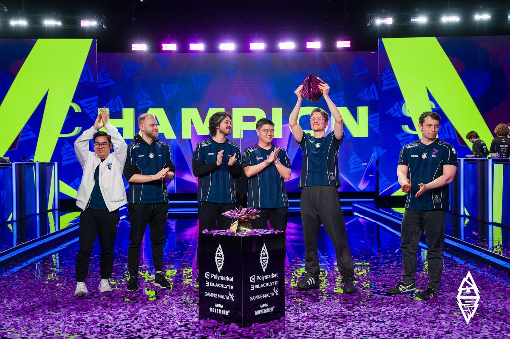

<p align="center">
  
</p>
<p align="center"><em>Team Liquid’s championship moment — Ace lifting the trophy after the Game 4 clincher.</em></p>

<p align="center">
  
</p>

<h1 align="center">BLAST Slam VI — Dota 2 Tournament Analytics</h1>

<p align="center">
  <strong>An interactive data-driven analysis of 100 professional Dota 2 matches.</strong><br/>
  <em>Does draft synergy or tempo win championships?</em>
</p>

<p align="center">
  
  
  
  
  
  
</p>

---

## 🏆 The Tournament

**BLAST Slam VI** — Malta, February 3–15, 2026 | $1,000,000 Prize Pool

Twelve of the world's best Dota 2 teams battled across 100 games. This website presents a comprehensive analytical breakdown of every match, hero pick, and strategic trend — powered by machine learning models that predicted the Grand Final outcome.

### Participating Teams

<table>
  <tr>
    <td align="center"><br/><strong>Team Liquid</strong><br/><sub>🏆 Champion</sub></td>
    <td align="center"><br/><strong>Natus Vincere</strong><br/><sub>🥈 2nd Place</sub></td>
    <td align="center"><br/><strong>OG</strong><br/><sub>3rd–4th</sub></td>
    <td align="center"><br/><strong>Team Yandex</strong><br/><sub>3rd–4th</sub></td>
    <td align="center"><br/><strong>Team Falcons</strong><br/><sub>5th–8th</sub></td>
    <td align="center"><br/><strong>HEROIC</strong><br/><sub>5th–8th</sub></td>
  </tr>
  <tr>
    <td align="center"><br/><strong>Tundra Esports</strong><br/><sub>5th–8th</sub></td>
    <td align="center"><br/><strong>Xtreme Gaming</strong><br/><sub>5th–8th</sub></td>
    <td align="center"><br/><strong>Team Spirit</strong><br/><sub>9th–12th</sub></td>
    <td align="center"><br/><strong>GamerLegion</strong><br/><sub>9th–12th</sub></td>
    <td align="center"><br/><strong>MOUZ</strong><br/><sub>9th–12th</sub></td>
    <td align="center"><br/><strong>REKONIX</strong><br/><sub>9th–12th</sub></td>
  </tr>
</table>

---

## 📊 What This Project Analyzes

This isn't just a tournament results page — it's a **data science investigation** into what actually wins professional Dota 2 matches.

### Core Research Question

> **Do top teams win because of hero synergy (draft cohesion) or tempo (early-game momentum)?**

### The Answer

**Synergy conquered tempo.** Team Liquid's championship-winning synergy index of 82.1 dismantled NaVi's tempo-first strategy (79.3) in a dominant 3-1 Grand Final. Our XGBoost model predicted this with 61.2% confidence — and it was right.

---

## 🧠 Key Findings

| Finding | Stat | Insight |
|---------|------|---------|
| **Synergy > Tempo** | Ratio: **1.15** | Draft cohesion outweighs raw aggression |
| **ML Validation** | XGBoost AUC: **0.716** | Model correctly predicted Liquid as champion |
| **Jakiro Meta** | **86% contest rate** | Most contested hero — 38 picks, 48 bans |
| **Comeback Factor** | **27.8% rate** | Tundra led at 46%, but slow tempo cost them |
| **Side Advantage** | Radiant WR: **52.1%** | Liquid's 74% Radiant WR was a strategic edge |
| **First Blood** | FB → Win: **59.2%** | Not a reliable predictor — NaVi had 70% FB rate but lost the final |

---

## 🐉 Most Contested Heroes

Hero icons sourced from the [Valve CDN](https://cdn.cloudflare.steamstatic.com/apps/dota2/images/dota_react/heroes/).

| Hero | Picks | Bans | Win Rate | Contest Rate | Role |
|------|-------|------|----------|--------------|------|
|  **Jakiro** | 38 | 48 | 52.6% | **86%** | Support |
|  **Shadow Demon** | 28 | 56 | 50.0% | **84%** | Support |
|  **Mars** | 33 | 29 | 48.5% | 62% | Offlane |
|  **Tiny** | 39 | 21 | 38.5% | 60% | Mid |
|  **Largo** | 28 | 29 | 46.4% | 57% | Offlane |

> **89 heroes picked** and **78 heroes banned** across all 100 games — a diverse and dynamic meta.

---

## 🖥️ Website Features

### Interactive Sections

| Section | Description |
|---------|-------------|
| **Hero Section** | Cinematic opening with BLAST branding, champion reveal, and particle effects |
| **Tournament Overview** | Live Gold Diff Timeline with team logos, interactive Playoff Bracket with SVG connector lines, key match summaries |
| **Hero Meta** | Most Contested Heroes bar chart with hero icons and tooltip cards; Win Rate vs Pick Rate scatter plot |
| **Synergy vs Tempo** | Team positioning scatter with logo overlays, playstyle spectrum bars, Top 4 comparison table |
| **Team Explorer** | Radar charts comparing any two teams across 6 metrics, detailed stat breakdowns |
| **Model Dashboard** | ROC curves, feature importance bars, Grand Final prediction breakdown |
| **Key Findings** | Six data-driven insight cards with animated reveals |
| **Predict the Winner** | Interactive quiz — guess match winners based on team stats |
| **Particle Arena** | Three.js animated background with floating particles |

### Design Philosophy

- **Dota 2 HUD Aesthetic** — Dark backgrounds (`#06091a`), gold accents (`#c3ff00`), glass-morphism cards
- **BLAST Branding** — Lime (`#c3ff00`) and pink (`#ff1a6c`) color scheme
- **Fully Responsive** — Mobile-first design, works on all screen sizes
- **Smooth Animations** — Framer Motion scroll reveals and hover interactions

---

## 🛠️ Tech Stack

| Technology | Purpose |
|-----------|---------|
| **[Next.js 14](https://nextjs.org/)** | React framework with App Router and SSR |
| **[TypeScript](https://www.typescriptlang.org/)** | Type-safe development |
| **[Tailwind CSS 3.4](https://tailwindcss.com/)** | Utility-first styling with custom Dota 2 theme |
| **[Plotly.js](https://plotly.com/javascript/)** | Interactive charts (scatter plots, timelines, bar charts) |
| **[Three.js](https://threejs.org/)** + React Three Fiber | 3D particle arena background |
| **[Framer Motion](https://www.framer.com/motion/)** | Scroll-triggered animations |
| **[Valve CDN](https://cdn.cloudflare.steamstatic.com/)** | Official Dota 2 hero icons |

### Fonts

- **[Inter](https://rsms.me/inter/)** — Body text
- **[Space Grotesk](https://fonts.google.com/specimen/Space+Grotesk)** — Headings
- **[JetBrains Mono](https://www.jetbrains.com/lp/mono/)** — Monospace / stats

---

## 🚀 Getting Started

### Prerequisites

- **Node.js** 18+
- **npm** or **yarn**

### Installation

```bash
# Clone the repository
git clone https://github.com/YOUR_USERNAME/blast-slam-6-analysis.git
cd blast-slam-6-analysis

# Install dependencies
npm install

# Start the development server
npm run dev
```

Open [http://localhost:3000](http://localhost:3000) to view the site.

### Build for Production

```bash
npm run build
npm start
```

### Deploy to Vercel

```bash
npx vercel
```

Or connect your GitHub repository to [Vercel](https://vercel.com) for automatic deployments.

---

## 📁 Project Structure

```
blast-slam-6-website/
├── public/
│   ├── blast_slam_logo.png          # Tournament logo
│   └── teams/                       # 12 team logos
│       ├── liquid.png
│       ├── navi.png
│       ├── og.png
│       └── ...
├── src/
│   ├── app/
│   │   ├── globals.css              # Tailwind + custom Dota 2 theme
│   │   ├── layout.tsx               # Root layout with fonts
│   │   └── page.tsx                 # Main page (9 dynamic sections)
│   ├── components/
│   │   ├── HeroSection.tsx          # Cinematic hero banner
│   │   ├── TournamentOverview.tsx   # Gold timeline + bracket
│   │   ├── HeroMeta.tsx             # Hero pick/ban analysis
│   │   ├── SynergyVsTempo.tsx       # Core analysis chart
```
